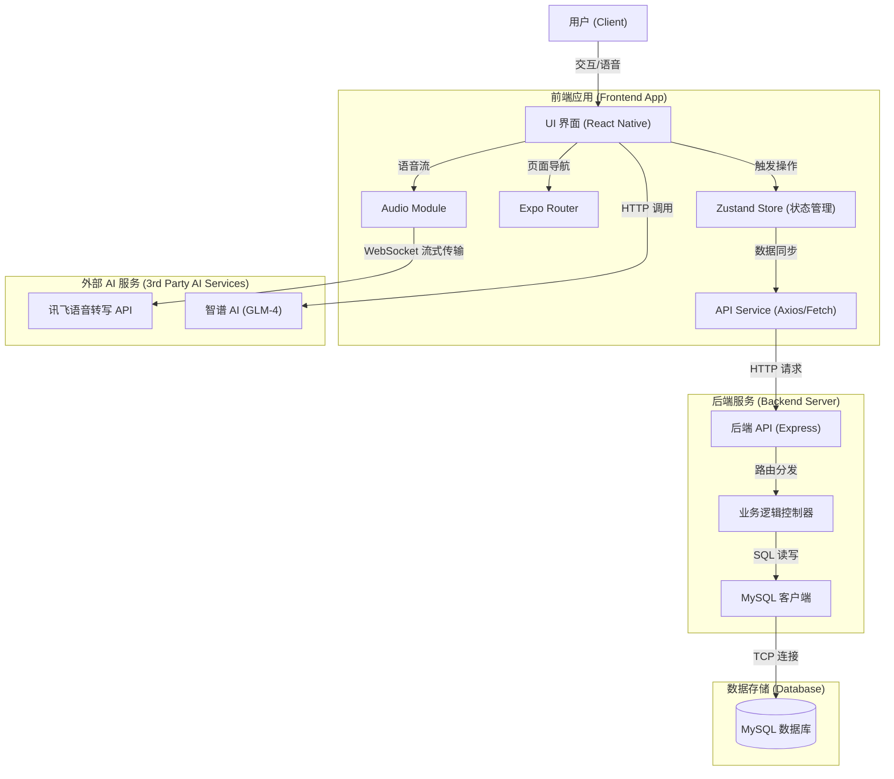

# Canlder 智能日程管理助手 - 产品技术报告

## 1. 产品功能介绍 (Product Features)

**Canlder** 是一款集日程管理、待办清单与 AI 智能辅助于一体的现代化个人效率工具。旨在帮助用户通过科学的时间管理方法（如四象限法则）和便捷的交互体验，提升生活与工作的效率。

### 1.1 核心功能模块

- **📅 智能日历 (Smart Calendar)**

  - **多视图切换**：支持月视图、周视图及日程列表视图。
  - **日程管理**：支持创建全天或特定时间段的日程。**[新增] 精确时间选择**：采用原生 DateTimePicker 组件，支持分钟级的时间设置与智能结束时间推算。
  - **智能提醒**：自动请求系统通知权限，支持设置自定义提前提醒时间（如提前 10 分钟），并在 App 前台/后台准时推送。
  - **待办联动**：自动将带有截止日期的待办事项同步显示在日历视图中，实现任务与时间的统一视图。

- **✅ 高效待办 (Power Checklist)**

  - **四象限管理**：支持按“重要-紧急”四象限分类任务，帮助用户通过艾森豪威尔矩阵科学规划优先级。
  - **属性丰富**：支持设置优先级（高/中/低）、截止日期、分类标签。
  - **交互激励**：任务完成时提供撒花（Confetti）动效，提供即时正向反馈。
  - **手势操作**：支持左滑删除、右滑标记等快捷手势。

- **🤖 AI 智能助手 (AI Assistant)**

  - **全知上下文**：AI 能够实时读取用户的日历和待办数据，回答如“我今天有什么安排？”或“近期有哪些高优先级任务？”等个性化问题。
  - **多模态交互**：支持语音输入（流式语音识别）和文本输入。
  - **智能建议**：基于当前任务负载，提供时间规划建议。

- **🎨 个性化体验**
  - **深色模式**：完美适配系统深色/浅色主题，提供舒适的视觉体验。
  - **数据持久化**：后端数据库实时同步，保证多端数据一致性。

---

## 2. 程序概要设计 (Program Outline Design)

### 2.1 数据模型设计 (Database Schema)

项目使用 MySQL 关系型数据库，主要包含以下核心数据表：

1.  **todos (待办事项表)**

    - `id`: 唯一标识符
    - `title`: 任务标题
    - `done`: 完成状态 (0/1)
    - `priority`: 优先级 (high/medium/low)
    - `quadrant`: 四象限分类 (I/II/III/IV)
    - `deadline`: 截止时间
    - `created_at`: 创建时间

2.  **events (日程事件表)**
    - `id`: 唯一标识符
    - `title`: 日程标题
    - `start_time`: 开始时间
    - `end_time`: 结束时间
    - `all_day`: 是否全天
    - `location`: 地点
    - `description`: 备注

### 2.2 接口设计 (API Design)

采用 RESTful 风格设计后端接口：

- `GET /api/todos`: 获取所有待办
- `POST /api/todos`: 创建新待办
- `PUT /api/todos/:id`: 更新待办状态/内容
- `GET /api/events`: 获取所有日程
- `POST /api/events`: 创建新日程

---

## 3. 软件架构图 (Software Architecture)

本项目采用经典的前后端分离架构，前端使用 React Native (Expo) 构建跨平台应用，后端使用 Node.js 提供 API 服务。

---

## 4. 技术亮点及其实现原理 (Technical Highlights)

### 4.1 上下文感知的 AI 助手 (Context-Aware AI)

- **亮点**：AI 不再是通用的聊天机器人，而是“知道”用户数据的私人助理。
- **实现原理**：
  在用户发送问题前，前端会拦截请求，通过 `System Prompt`（系统提示词）技术，将当前的 `todos`（待办数组）和 `events`（日程数组）序列化为 JSON 字符串，注入到 AI 的对话上下文中。
  > **Prompt 示例**： "你是一个日程助手。以下是用户的待办数据：[...JSON...]。请根据这些数据回答用户问题。"

### 4.2 待办与日历的智能融合 (Todo-Calendar Sync)

- **亮点**：打破了清单与日历的隔离，有截止日期的任务自动映射到时间轴上。
- **实现原理**：
  在前端 Store 中，利用 `useMemo` 或 `Selector` 机制，动态过滤出带有 `deadline` 且未完成的 Todo 项，将其转换为符合日历组件格式的 `Event` 对象，并与原生 Events 合并渲染。这样既保证了数据源的单一性（Single Source of Truth），又实现了视图的融合。

### 4.3 乐观 UI 更新 (Optimistic UI Updates)

- **亮点**：用户操作（如勾选完成）无延迟，体验极致流畅。
- **实现原理**：
  在调用后端 API 之前，先立即更新前端的 Zustand Store 状态（例如直接将 `done` 设为 `true` 并触发撒花动画）。如果后端请求失败，再回滚状态。这种策略最大化了用户感知的响应速度。

### 4.5 多平台适配与兼容性 (Platform Adaptation)

- **亮点**：无缝运行于 Android、iOS 及 Web 端，针对不同平台特性优化交互。
- **实现原理**：
  - **通知权限**：在原生端自动检测并请求 `expo-notifications` 权限，在 Web 端自动降级处理并弹出友好提示。
  - **原生组件**：在时间选择上，根据平台自动切换使用 `DateTimePicker` (原生) 或 `HTML Input` (Web)，保证最佳体验。
  - **时区容错**：后端存储时区无关的标准时间，前端智能推断用户本地时区，解决跨时区协作的数据一致性问题。
